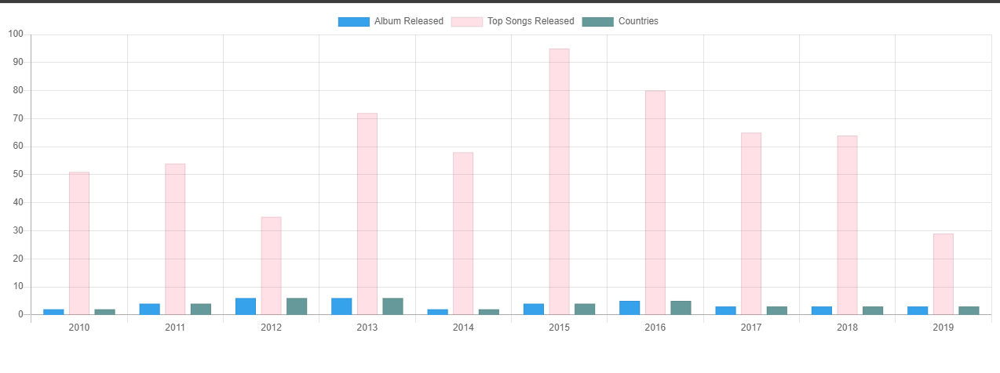

## Restful API with Node JS and Express Js and SQLite

Developed a robust RESTful API encompassing three datasets sourced from the Kaggle website.

## Visualization

The visualization is implemented using Chart.js. The bar chart plots the album released, top songs released, and the countries, providing a visual comparison of these attributes.



## Installation 

 After cloning the project with any code editor preferably (IntelliJ Ultimate or Visual studio code) 

Type to install all the packages needed

```
npm install
```


## How to Run

Type the command to start the server

```
node server.js or
nodemon server.js
```

## Endpoint

These are the various endpoints 

http://localhost:4000/api/album

http://localhost:4000/api/topsong

http://localhost:4000/api/country

All have functionalities of CRUD both in xml and Json and data is validated.

The Content-type should be changed to application/json or application/xml. 

## Technologies Used
- Node.Js and Express.js: Used for creating the RESTful API.
- SQLite: Used as the database to store the  data.
- Chart.js: Used for creating the bar chart visualization.
- 
Postman for testing the endpoints.

This is a link to download DB browser for SQLite  https://sqlitebrowser.org/dl/ if you want to load the database found in the project as **database.sqlite**, but it is not needed to test the endpoints.

#### Note do not forget to specify the content type in the header for either json or xml when testing the endpoints in Postman
